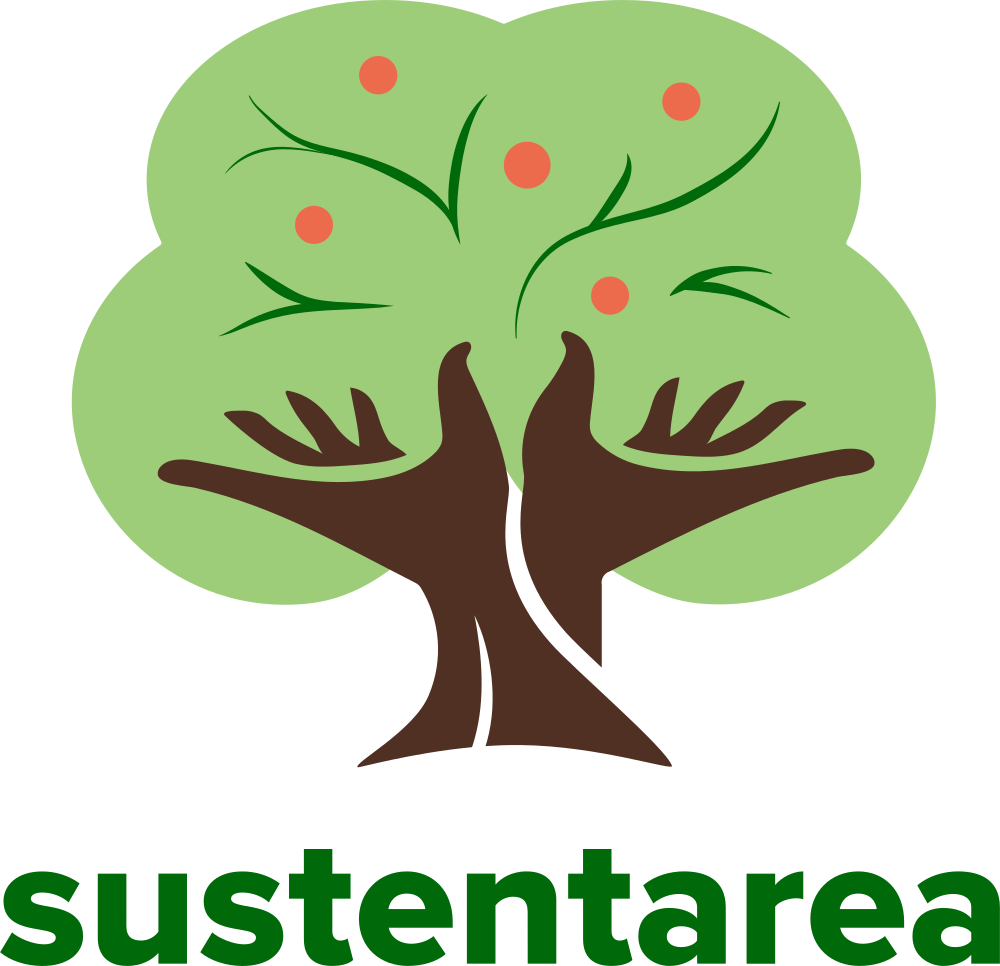

# r-course

<!-- badges: start -->
[](https://www.repostatus.org/#active)
[](https://doi.org/10.5281/zenodo.18332665)
[](https://fairsoftwarechecklist.net/v0.2?f=21&a=32113&i=02310&r=123)
[](https://fair-software.eu)
[](https://www.gnu.org/licenses/gpl-3.0)
[](https://creativecommons.org/licenses/by-nc-sa/4.0/)
[](https://www.contributor-covenant.org/version/3/0/code_of_conduct/)
<!-- badges: end -->

## Overview

This repository hosts the slides and materials for an introductory [R](https://www.r-project.org/) programming course developed for the Center for Metropolitan Studies ([CEM](https://centrodametropole.fflch.usp.br/)) at the University of São Paulo ([USP](https://www5.usp.br/)).

The slides are available [here](https://danielvartan.github.io/r-course/).

## Usage

The slides are built with the [Quarto](https://quarto.org/) publishing system and the [R](https://www.r-project.org/) programming language. The [`renv`](https://rstudio.github.io/renv/) package manages the R environment to ensure reproducibility.

After installing these three dependencies, follow these steps to reproduce the results:

1. **Clone** this repository to your local machine.
2. **Open** the project in your preferred [IDE](https://en.wikipedia.org/wiki/Integrated_development_environment).
3. **Restore the R environment** by running [`renv::restore()`](https://rstudio.github.io/renv/reference/restore.htreportml) in the R console.
4. **Open** `index.qmd` and run the code as described.

## Rendering

After installing all dependencies (see the [Usage](#usage) section), run the following command in the terminal from the project's root directory:

```bash
quarto render
```

This will start the rendering process, which may take some time depending on your machine. Once complete, the [Quarto](https://quarto.org/) presentation will be available in the [`docs`](docs) folder.

## Contributing

[](https://www.contributor-covenant.org/version/3/0/code_of_conduct/)

Contributions are always welcome! Whether you want to report bugs, suggest new features, or help improve the code or documentation, your input makes a difference.

Before opening a new issue, please check the [issues tab](https://github.com/danielvartan/r-course/issues) to see if your topic has already been reported.

## License

[](https://www.gnu.org/licenses/gpl-3.0)
[](https://creativecommons.org/licenses/by-nc-sa/4.0/)

The code in this repository is licensed under the [GNU General Public License Version 3](https://www.gnu.org/licenses/gpl-3.0), while the slides are available under the [Creative Commons Attribution-NonCommercial-ShareAlike 4.0 International](https://creativecommons.org/licenses/by-nc-sa/4.0/).

```
Copyright (C) Daniel Vartanian

The code in this report is free software: you can redistribute it and/or
modify it under the terms of the GNU General Public License as published by the
Free Software Foundation, either version 3 of the License, or (at your option)
any later version.

This program is distributed in the hope that it will be useful, but WITHOUT ANY
WARRANTY; without even the implied warranty of MERCHANTABILITY or FITNESS FOR A
PARTICULAR PURPOSE. See the GNU General Public License for more details.

You should have received a copy of the GNU General Public License along with
this program. If not, see <https://www.gnu.org/licenses/>.
```

## Citation

[](https://doi.org/10.5281/zenodo.18332665)

To cite this work, please use the following format:

Vartanian, D. (2025). *An introduction to the R programming language*. Center for Metropolitan Studies, University of São Paulo. <https://doi.org/10.5281/zenodo.18332665>

A BibLaTeX entry for LaTeX users is:

```
@software{vartanian2026,
  title = {An introduction to the R programming language},
  author = {{Daniel Vartanian}},
  year = {2026},
  address = {São Paulo},
  institution = {Center for Metropolitan Studies, University of São Paulo},
  langid = {en},
  doi = {10.5281/zenodo.18332665},
  note = {Computer software}
}
```

## Acknowledgments

<table>
  <tr>
    <td width="30%" align="center" valign="center">
        <a href="https://centrodametropole.fflch.usp.br"></a>
    </td>
    <td width="70%" valign="center">
      This work was developed with support from the Center for Metropolitan Studies (<a href="https://centrodametropole.fflch.usp.br">CEM</a>) based at the School of Philosophy, Letters and Human Sciences (<a href="https://www.fflch.usp.br/">FFLCH</a>) at the University of São Paulo (<a href="https://usp.br">USP</a>) and at the Brazilian Center for Analysis and Planning (<a href="https://cebrap.org.br/">CEBRAP</a>).
    </td>
  </tr>
</table>

<table>
  <tr>
    <td width="30%" align="center" valign="center">
      <a href="https://fapesp.br/"></a>
    </td>
    <td width="70%" valign="center">
      This work was financed, in part, by the São Paulo Research Foundation (<a href="https://fapesp.br/">FAPESP</a>), Brazil. Process Number <a href="https://bv.fapesp.br/en/bolsas/231507/geospatial-data-science-applied-to-food-policies/">2025/17879-2</a>.
    </td>
  </tr>
</table>

<table>
  <tr>
    <td width="30%" align="center" valign="center">
      <a href="https://www.fsp.usp.br/sustentarea/"></a>
    </td>
    <td width="70%" valign="center">
      This work was developed with support from the <a href="https://www.fsp.usp.br/sustentarea/">Sustentarea</a> Research and Extension Group at the University of São Paulo (<a href="https://usp.br/">USP</a>).
    </td>
  </tr>
</table>

<table>
  <tr>
    <td width="30%" align="center" valign="center">
      <a href="https://fapesp.br/"></a>
    </td>
    <td width="70%" valign="center">
      This work was financed, in part, by the National Council for Scientific and Technological Development (<a href="https://www.gov.br/cnpq/">CNPq</a>), Brazil. Process Number 383443/2024-5.
    </td>
  </tr>
</table>
